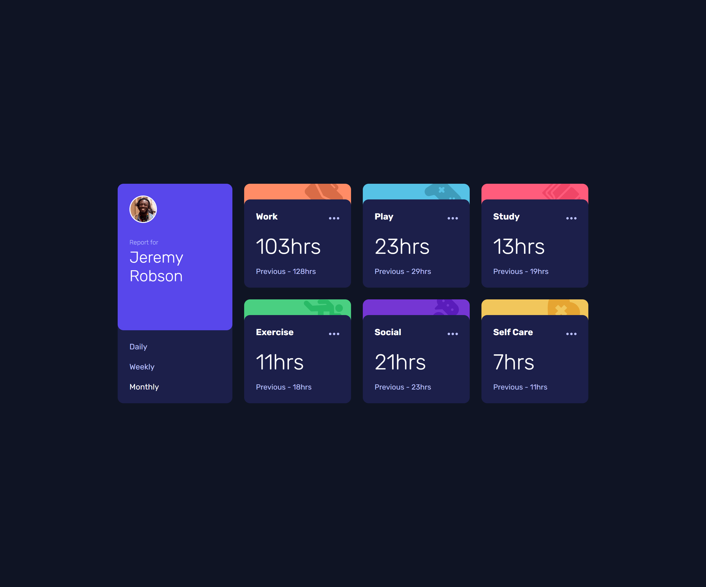
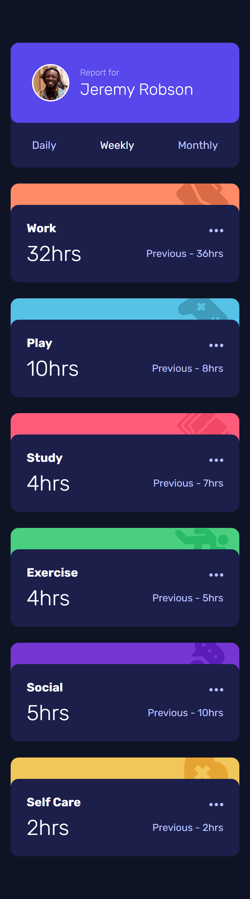

# Time tracking dashboard solution

This is a solution to the [Time tracking dashboard challenge on Frontend Mentor](https://www.frontendmentor.io/challenges/time-tracking-dashboard-UIQ7167Jw).

## Table of contents

- [Overview](#overview)
  - [The challenge](#the-challenge)
  - [Screenshots](#screenshots)
  - [Links](#links)
- [My process](#my-process)
  - [Built with](#built-with)
  - [What I learned](#what-i-learned)
- [Author](#author)

## Overview

### The challenge

Users should be able to:

- View the optimal layout for the site depending on their device's screen size
- See hover states for all interactive elements on the page
- Switch between viewing Daily, Weekly, and Monthly stats

### Screenshots

#### Desktop



#### Mobile



### Links

- Solution URL: [Code](https://github.com/hellcsaba/time-tracking-dashboard)
- Live Site URL: [Time tracking dashboard live](https://hellcsaba.github.io/time-tracking-dashboard/)

## My process

### Built with

- Semantic HTML5 markup
- HTML data attributes
- CSS custom properties
- Flexbox
- CSS Grid
- Mobile-first workflow
- JavaScript

### What I learned

I learnt how to manage the period selection functionality using HTML data attributes and JavaScript. I added event listeners to the period-selector buttons (daily, weekly, monthly) and based on the data-time HTML data attribute I can get the clicked button. Then I can select the hours and previous hours related to the selected period. The benefit of that is I can easily extend it with other period buttons since I just need to assign a new value for the data-time attribute. The solution is not perfect since currently I would need to add more hours and previous paragraphs for new periods because it's not dynamically created (just the display property changes).

```html
<div class="profile__period-selector">
  <button class="profile__period-btn" data-time="daily">Daily</button>
  <button class="profile__period-btn profile__period-btn--active" data-time="weekly">Weekly</button>
  <button class="profile__period-btn" data-time="monthly">Monthly</button>
</div>
```

```js
const selectedTime = this.getAttribute("data-time");

const selectedHours = document.querySelectorAll(`.activity__hours[data-hours="${selectedTime}"]`);

const selectedPrevious = document.querySelectorAll(`.activity__previous[data-previous="${selectedTime}"]`);
```

## Author

- Website - [Csaba Hell](https://github.com/hellcsaba)
- Frontend Mentor - [@hellcsaba](https://www.frontendmentor.io/profile/hellcsaba)
- LinkedIn - [@csabahell](https://www.linkedin.com/in/csabahell/)
